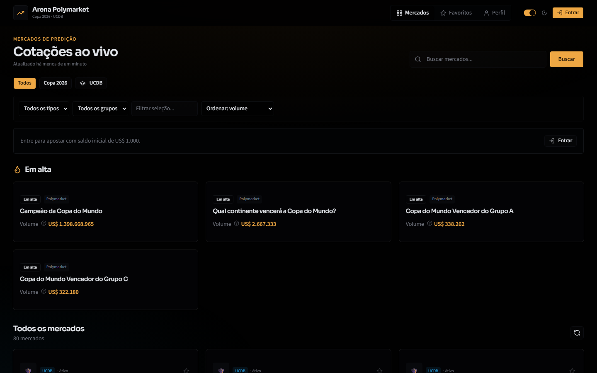

<p align="center">
  
</p>

<h1 align="center">Arena Polymarket — Copa do Mundo 2026</h1>

<p align="center">
  Interface em português para explorar <strong>cotações de mercados de predição</strong> da Copa do Mundo FIFA 2026 no
  <a href="https://polymarket.com">Polymarket</a>, com mercados simulados da UCDB, favoritos, alertas de preço e apostas com saldo virtual.
</p>



## Screenshots

| Tela | Descrição |
|------|-----------|
| [Dashboard](docs/screenshots/01-dashboard-light.png) | Listagem de mercados, filtros e seção “Em alta” |
| [Tema escuro](docs/screenshots/02-dashboard-dark.png) | Mesma visão com dark mode |
| [Busca](docs/screenshots/03-search-results.png) | Resultados filtrados por “Copa do Mundo” |
| [Detalhe do evento](docs/screenshots/04-event-details.png) | Probabilidades, gráficos e order book |
| [Mercados UCDB](docs/screenshots/05-ucdb-markets.png) | Mercados simulados da universidade |
| [Favoritos](docs/screenshots/06-favorites.png) | Página de mercados salvos |

## Funcionalidades

- Pesquisa de mercados da Copa 2026 (termos em PT ou EN, tradução automática)
- Probabilidades/cotações em tempo real (Sim/Não ou múltiplas opções)
- Volume, liquidez e status do mercado
- Histórico de preços e order book via CLOB API
- Mercados simulados UCDB com saldo inicial de US$ 1.000
- Favoritos, alertas de variação e tour de onboarding
- Login opcional com Google (Firebase)
- Tema claro/escuro

## Stack

- React 19 + TypeScript + Vite
- Express (proxy das APIs Polymarket)
- Tailwind CSS 4 + shadcn/ui
- Recharts (gráficos)
- Firebase Auth + Firestore (opcional)

## Pré-requisitos

- Node.js 18+

## Executar localmente

```bash
npm install
npm run dev
```

Abra **http://localhost:3000**

### Build de produção

```bash
npm run build
npm start
```

## Deploy no Netlify

O projeto inclui `netlify.toml` com **Netlify Functions** para as rotas `/api/*` (sem isso, o site estático retorna “Falha ao buscar mercados”).

1. Conecte o repositório no Netlify (o `netlify.toml` define build e redirects).
2. Em **Environment variables**, adicione as variáveis `VITE_FIREBASE_*` (como na captura de tela).
3. No **Firebase Console → Authentication → Authorized domains**, adicione `seu-site.netlify.app`.
4. Faça **Trigger deploy** após push ou redeploy manual.

Build usado pelo Netlify: `npm run build:netlify` → publica `dist/` + funções em `netlify/functions/`.

## APIs utilizadas

| API | Base URL | Uso | Autenticação |
|-----|----------|-----|--------------|
| **Gamma API** | `https://gamma-api.polymarket.com` | Eventos e mercados | Pública |
| **CLOB API** | `https://clob.polymarket.com` | Preços e order book | Pública (leitura) |

Documentação: [docs.polymarket.com](https://docs.polymarket.com/api-reference/introduction)

> A Gamma e a CLOB (leitura) são públicas. `POLYMARKET_API_KEY` só é necessária para trading autenticado.

## Endpoints locais (proxy)

| Método | Rota | Descrição |
|--------|------|-----------|
| `GET` | `/api/markets?q=Copa do Mundo` | Busca mercados |
| `GET` | `/api/events/:slug` | Detalhe de evento |
| `GET` | `/api/prices/:tokenId` | Histórico de preços |
| `GET` | `/api/wallet?email=` | Saldo simulado |
| `POST` | `/api/bets` | Registrar aposta simulada |

## Variáveis de ambiente

Copie `.env.example` para `.env.local`:

```env
POLYMARKET_API_KEY=""
VITE_FIREBASE_API_KEY=""
VITE_FIREBASE_AUTH_DOMAIN=""
VITE_FIREBASE_PROJECT_ID=""
```

Firebase é opcional — o app funciona sem login.

## Estrutura do projeto

```
polymarket-explorer/
├── docs/screenshots/     # Prints do site (README)
├── public/               # PWA (manifest, service worker)
├── scripts/              # Automação (captura de screenshots)
├── src/
│   ├── components/       # UI (Dashboard, EventDetails, etc.)
│   ├── lib/              # Utilitários (favoritos, mercados)
│   └── services/         # Firestore
├── lib/                  # Proxy Polymarket (server-side)
├── components/ui/        # shadcn/ui
├── server.ts             # Express + Vite dev server
└── firestore.rules       # Regras Firestore (opcional)
```

## Exemplos de pesquisa

- `Copa do Mundo` → traduzido para "world cup"
- `World Cup` → busca direta
- `FIFA` → mercados FIFA
- `Grupo A` → vencedores de grupos

## Regenerar screenshots

Com o servidor rodando (`npm run dev`):

```bash
npm run screenshots
```

## Licença

MIT — veja [LICENSE](LICENSE).
